# 👋 Hey there, I'm Durgesh Bachhav

<div align="center">
  
  ### 🚀 Turning Vision into Virtual Reality
  
  [](https://github.com/durgeshbachhav)
  [](https://github.com/durgeshbachhav)
  [](https://linkedin.com/in/durgesh-bachhav-b5899322b)
  
</div>

---

## 🎯 About Me

```javascript
const durgesh = {
    location: "India",
    role: "Full Stack Developer",
    passion: "Creating seamless digital experiences",
    currentFocus: "Frontend & Backend Development",
    funFact: "I'm basically a professional Googler at this point! 🔍"
};
```

- 🌐 **Portfolio**: [durgeshbachhav.vercel.app](https://durgeshbachhav.vercel.app/)
- ✍️ **Blog**: Writing tech articles on [Medium](https://medium.com/@bachhavdurgesh123)
- 💬 **Let's talk about**: Frontend, Backend, and everything in between
- 📧 **Reach me**: bachhavdurgesh123@gmail.com

---

## 🛠️ Tech Stack

<div align="center">

### Frontend


### Backend & Database


### Tools & Others


</div>

---

## 🌐 Connect With Me

<div align="center">
  
[](https://linkedin.com/in/durgesh-bachhav-b5899322b)
[](https://medium.com/@bachhavdurgesh123)
[](https://instagram.com/durgesh.bachhav_)
[](https://stackoverflow.com/users/durgesh-bachhav)
[](https://codepen.io/@nikkhil)
[](https://dribbble.com/doorgesh)
[](https://hashnode.com/@durgesh2901)

</div>

---

## 🌟 Featured Projects

<div align="center">

### 🔥 **Starred Repository** (2000+ ⭐)
[](https://github.com/durgeshbachhav/your-popular-repo)

</div>

<table align="center">
<tr>
<td width="50%">

### 🚀 **Top Projects**
- **[Project Name 1](https://github.com/durgeshbachhav/project1)** - Brief description of your amazing project
  <br>🛠️ `React` `Node.js` `MongoDB`
  
- **[Project Name 2](https://github.com/durgeshbachhav/project2)** - Another cool project description
  <br>🛠️ `Next.js` `TypeScript` `PostgreSQL`

- **[Project Name 3](https://github.com/durgeshbachhav/project3)** - Third awesome project
  <br>🛠️ `React Native` `Express` `MySQL`

</td>
<td width="50%">

### 🎯 **Recent Work**
- **[Latest Project](https://github.com/durgeshbachhav/latest)** - What you're currently building
  <br>🛠️ `Next.js` `Appwrite` `Tailwind`
  
- **[Cool Animation Project](https://github.com/durgeshbachhav/animations)** - CSS/JS animations showcase
  <br>🛠️ `HTML5` `CSS3` `JavaScript`

- **[Open Source Contribution](https://github.com/some-org/project)** - Your contribution to community
  <br>🛠️ `Various Technologies`

</td>
</tr>
</table>

---

## 📊 GitHub Analytics

<div align="center">
  


</div>

<div align="center">
  
[](https://github.com/durgeshbachhav)

</div>

---

## 🎨 Cool Animations & Widgets

<div align="center">

### 🐍 Snake eating my contributions


### ⚡ Dynamic GitHub Activity
<!--START_SECTION:activity-->
<!--END_SECTION:activity-->

### 📈 Coding Time This Week
<!--START_SECTION:waka-->
<!--END_SECTION:waka-->

</div>

---

## 🎯 Current Focus & Goals

```mermaid
graph LR
    A[🎯 Current Goals] --> B[Master Next.js 14]
    A --> C[Contribute to OSS]
    A --> D[Build SaaS Products]
    A --> E[Learn Web3]
    
    B --> F[App Router]
    C --> G[React Ecosystem]
    D --> H[Full Stack Apps]
    E --> I[Smart Contracts]
```

<div align="center">



</div>

**🔭 What I'm Working On:**
- 🚀 Building a revolutionary SaaS platform
- 🎨 Creating reusable React component library
- 📱 Developing a React Native mobile app
- 🤖 Exploring AI/ML integration in web apps

**🌱 Currently Learning:**
- Next.js 14 App Router & Server Components
- GraphQL & Apollo Client
- Docker & Kubernetes
- Web3 & Blockchain Development

---

## 🔥 Streak & Achievements

<div align="center">

### 🎯 **Developer Achievements**


### 📊 **Coding Metrics**


</div>

---

## 🏆 GitHub Trophies

<div align="center">
  
[](https://github.com/durgeshbachhav)

</div>

---

<div align="center">
  
### 💭 *"Code is like humor. When you have to explain it, it's bad."* – Cory House

**Thanks for stopping by! Let's build something amazing together** 🚀

</div>
